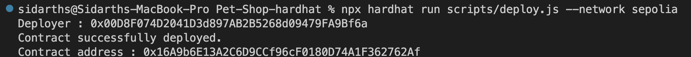
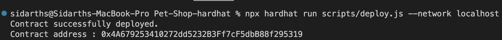
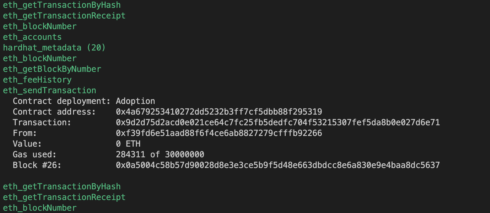
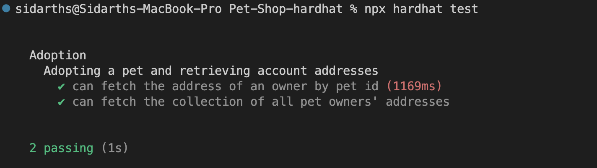
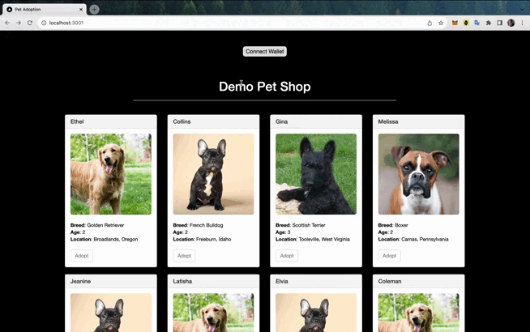

# **Pet-Shop-hardhat**
Hardhat Implementation of https://trufflesuite.com/guides/pet-shop<br/>

**Try running some of the following tasks:**
<br/>

- To Deploy Contract in localhost :
    - Open a terminal in the working directory and run :
        ```shell
        npx hardhat node
        ```
    - Open another terminal in the same working directory and run :
        ```shell
        npx hardhat run scripts/deploy.js --network localhost
        ```

- To Deploy Contract in Sepolia:
    - Update ```.env``` with private keys and api keys
    - Run the following command
        ```shell
        npx hardhat run scripts/deploy.js --network sepolia
        ```

- To Run hardhat test : 
    ```shell
    npx hardhat test
    ```

- To use DApp:
    - Update ```contractAddress```  in ```src/pages/index.js```
    - Run the following command
        ```shell
        npm run dev
        ```
    - open localhost and interact with the DApp


---
## Demo Screenshots :

### Deploy Contract in Sepolia
- **deploy script output** : 
    
- **Deployed Contract in etherscan (sepolia)** : 
    - https://sepolia.etherscan.io/address/0x16A9b6E13A2C6D9CCf96cF0180D74A1F362762Af

### Deploy Contract in localhost
- **deploy script output** : 
    
- **Contract Deployed in localhost Node** : 
    

### Hardhat Test Results


## DApp Demo :

- ref Tx : https://sepolia.etherscan.io/tx/0x18d412878afd00b38d20df4e25e462eb0f88342d6532aa44e63adfdf16bfb244
